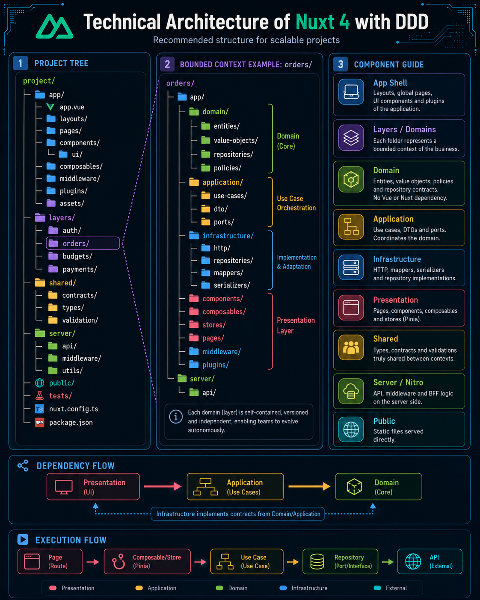

# Nuxt 4 with DDD and Clean Architecture

Reference architecture for **Nuxt 4** applications organized around **bounded contexts**, using **Domain-Driven Design**, **Clean Architecture**, **Nuxt Layers**, **TypeScript**, and **Pinia**.

> Goal: keep business rules independent from Vue, Nuxt, Pinia, HTTP, and external implementation details, enabling modular evolution, isolated testing, and a clear separation of responsibilities.



## Table of Contents

- [Overview](#overview)
- [Principles](#principles)
- [Project Structure](#project-structure)
- [Bounded Context Structure](#bounded-context-structure)
- [Layer Responsibilities](#layer-responsibilities)
- [Architecture Flows](#architecture-flows)
- [Installation](#installation)
- [Main Nuxt Configuration](#main-nuxt-configuration)
- [Layer Configuration](#layer-configuration)
- [Aliases and Imports](#aliases-and-imports)
- [Runtime Config](#runtime-config)
- [Dependency Rules](#dependency-rules)
- [App Shell](#app-shell)
- [Pinia](#pinia)
- [Server and Nitro](#server-and-nitro)
- [Testing](#testing)
- [Recommended Scripts](#recommended-scripts)
- [New Domain Checklist](#new-domain-checklist)
- [Architectural Decisions](#architectural-decisions)
- [Official References](#official-references)

## Overview

The project is divided across two dimensions:

1. **Business domains:** `auth`, `orders`, `budgets`, `payments`, and other bounded contexts.
2. **Internal layers inside each domain:** `domain`, `application`, `infrastructure`, and `presentation`.

In Nuxt 4, directories placed inside `layers/` are automatically registered. Each layer should have its own `nuxt.config.ts`, even when it does not require additional configuration.

## Principles

- Organize primarily by business domain, not only by technical file type.
- `domain` must not depend on Vue, Nuxt, Pinia, `$fetch`, the browser, or a database.
- `application` coordinates use cases and depends on the domain.
- `infrastructure` implements ports and contracts defined by internal layers.
- `presentation` contains pages, components, composables, and stores.
- Pages should remain thin and work as UI composition points.
- Components should receive data through props and emit events.
- External DTOs should not flow directly through the domain.
- Mappers convert API responses into domain objects.
- Code shared between the frontend and Nitro should only be placed in `shared/` when it is truly environment-agnostic.

## Project Structure

```text
project/
├── app/                            # Main application shell
│   ├── app.vue
│   ├── app.config.ts
│   ├── assets/
│   │   └── styles/
│   ├── components/
│   │   └── ui/                     # Shared design system
│   ├── composables/                # Global composables
│   ├── layouts/
│   ├── middleware/
│   ├── pages/                      # Global or cross-domain routes
│   ├── plugins/
│   └── utils/
│
├── layers/                         # Local bounded contexts
│   ├── auth/
│   │   └── nuxt.config.ts
│   ├── orders/
│   │   └── nuxt.config.ts
│   ├── budgets/
│   │   └── nuxt.config.ts
│   └── payments/
│       └── nuxt.config.ts
│
├── shared/                         # Code shared between the app and Nitro
│   ├── contracts/
│   ├── types/
│   ├── constants/
│   └── validation/
│
├── server/                         # Global Nitro/BFF layer
│   ├── api/
│   ├── middleware/
│   ├── plugins/
│   ├── routes/
│   └── utils/
│
├── public/                         # Files served without build processing
├── tests/
│   ├── unit/
│   ├── integration/
│   └── e2e/
│
├── .env.example
├── nuxt.config.ts
├── package.json
├── tsconfig.json
└── README.md
```

## Bounded Context Structure

Example for the `orders` domain:

```text
layers/orders/
├── nuxt.config.ts
├── app/
│   ├── domain/
│   │   ├── entities/
│   │   ├── value-objects/
│   │   ├── repositories/           # Domain repository interfaces/ports
│   │   ├── services/               # Pure domain services
│   │   ├── policies/
│   │   ├── events/
│   │   └── errors/
│   │
│   ├── application/
│   │   ├── use-cases/
│   │   ├── dto/
│   │   ├── ports/
│   │   └── errors/
│   │
│   ├── infrastructure/
│   │   ├── http/
│   │   ├── repositories/
│   │   ├── mappers/
│   │   ├── serializers/
│   │   ├── adapters/
│   │   └── factories/
│   │
│   ├── components/                 # Presentation
│   ├── composables/                # Presentation and UI orchestration
│   ├── layouts/
│   ├── middleware/
│   ├── pages/
│   ├── plugins/                    # Domain composition root
│   ├── stores/                     # Pinia: UI and session state
│   └── utils/
│
└── server/
    └── api/                         # Domain-specific Nitro endpoints
```

## Layer Responsibilities

### Domain

Contains the essential business rules:

- entities;
- value objects;
- invariants;
- policies;
- domain events;
- repository interfaces;
- business errors.

The domain should be written in pure TypeScript.

```ts
export class Order {
  constructor(
    public readonly id: string,
    private status: 'draft' | 'approved' | 'cancelled',
  ) {}

  cancel(): void {
    if (this.status === 'approved') {
      throw new Error('Approved orders cannot be cancelled');
    }

    this.status = 'cancelled';
  }
}
```

### Application

Coordinates application workflows:

- use cases;
- input and output DTOs;
- ports for external services;
- transactions and orchestration;
- contextual authorization when it belongs to the use case.

```ts
export class CancelOrderUseCase {
  constructor(private readonly repository: OrderRepository) {}

  async execute(orderId: string): Promise<void> {
    const order = await this.repository.findById(orderId);

    if (!order) {
      throw new Error('Order not found');
    }

    order.cancel();
    await this.repository.save(order);
  }
}
```

### Infrastructure

Implements technical details:

- REST, GraphQL, or WebSocket communication;
- repository implementations;
- serializers and mappers;
- local persistence;
- observability;
- adapters for external services.

```ts
export class HttpOrderRepository implements OrderRepository {
  constructor(
    private readonly apiBase: string,
    private readonly fetcher: typeof $fetch = $fetch,
  ) {}

  async findById(id: string): Promise<Order | null> {
    const response = await this.fetcher<OrderResponse>(`${this.apiBase}/orders/${id}`);

    return OrderMapper.toDomain(response);
  }
}
```

### Presentation

In Nuxt, this layer is mainly composed of:

```text
pages/
components/
composables/
stores/
layouts/
middleware/
```

It may depend on `application`, but it must not implement critical business rules.

## Architecture Flows

### Dependency Flow

```text
Presentation ─────▶ Application ─────▶ Domain
       │                                      ▲
       └──────── Infrastructure ──────────────┘
                 implements contracts
```

### Execution Flow

```text
Page
  └──▶ Composable or Store
        └──▶ Use Case
              └──▶ Repository Port
                    └──▶ Repository Adapter
                          └──▶ External API or Nitro
```

## Installation

Create a Nuxt 4 project:

```bash
pnpm dlx nuxi@latest init nuxt-ddd-app
cd nuxt-ddd-app
pnpm install
```

Install Pinia:

```bash
pnpm add pinia @pinia/nuxt
```

Install type-checking dependencies:

```bash
pnpm add -D typescript vue-tsc
```

Create the initial layers:

```bash
mkdir -p layers/{auth,orders,budgets,payments}/app
mkdir -p layers/{auth,orders,budgets,payments}/server

touch layers/auth/nuxt.config.ts
touch layers/orders/nuxt.config.ts
touch layers/budgets/nuxt.config.ts
touch layers/payments/nuxt.config.ts
```

## Main Nuxt Configuration

File: `nuxt.config.ts`

```ts
import { fileURLToPath } from 'node:url';

export default defineNuxtConfig({
  compatibilityDate: '2026-06-15',

  devtools: {
    enabled: true,
  },

  ssr: true,

  modules: ['@pinia/nuxt'],

  css: ['~/assets/styles/main.css'],

  runtimeConfig: {
    // Available only on the server.
    apiToken: '',

    public: {
      // Available on both the server and the browser.
      apiBase: '/api',
      appName: 'Nuxt DDD',
    },
  },

  alias: {
    // Global aliases should only point to truly cross-cutting modules.
    '#core': fileURLToPath(new URL('./app/core', import.meta.url)),
  },

  pinia: {
    storesDirs: ['app/stores/**', 'layers/*/app/stores/**'],
  },

  typescript: {
    strict: true,
    typeCheck: true,
    tsConfig: {
      compilerOptions: {
        noUncheckedIndexedAccess: true,
        exactOptionalPropertyTypes: true,
      },
    },
  },

  app: {
    head: {
      htmlAttrs: {
        lang: 'en',
      },
      titleTemplate: '%s · Nuxt DDD',
      meta: [
        {
          name: 'viewport',
          content: 'width=device-width, initial-scale=1',
        },
      ],
    },
  },
});
```

### Why are local layers not added to `extends`?

Layers placed directly inside `layers/` are automatically detected by Nuxt. Use `extends` only when loading an external layer, a published package, a remote layer, or a directory outside `layers/`.

Example for an external layer:

```ts
export default defineNuxtConfig({
  extends: ['../company-design-system'],
});
```

## Layer Configuration

Each bounded context needs its own `nuxt.config.ts`.

Example: `layers/orders/nuxt.config.ts`

```ts
export default defineNuxtConfig({
  $meta: {
    name: 'orders',
  },
});
```

The configuration may also remain empty:

```ts
export default defineNuxtConfig({});
```

Nuxt merges the layer configuration with the root configuration.

## Aliases and Imports

Nuxt creates automatic aliases for local layers:

```ts
import { Order } from '#layers/orders/domain/entities/Order';
import type { OrderRepository } from '#layers/orders/domain/repositories/OrderRepository';
```

Useful aliases already provided by Nuxt:

```text
~/           → app/
@/           → app/
~~/          → project root
@@/          → project root
#shared/     → shared/
#server/     → server/
#layers/...  → srcDir of the corresponding layer
```

### Recommended Rule

Do not configure global auto-imports for `domain`, `application`, or `infrastructure`. Explicit imports keep dependencies visible and reduce accidental coupling.

## Runtime Config

File: `.env`

```dotenv
NUXT_API_TOKEN=server-only-secret
NUXT_PUBLIC_API_BASE=https://api.example.com
NUXT_PUBLIC_APP_NAME=Nuxt DDD
```

Usage on the server or inside a plugin:

```ts
const config = useRuntimeConfig();

console.log(config.apiToken);
console.log(config.public.apiBase);
```

Only properties inside `runtimeConfig.public` may be exposed to the browser.

## Dependency Rules

### Allowed

```text
presentation    → application
application     → domain
infrastructure  → domain
infrastructure  → application
server          → application
```

### Forbidden

```text
domain          → Vue
domain          → Nuxt
domain          → Pinia
domain          → $fetch
domain          → localStorage
application     → Vue components
application     → UI stores
```

### Communication Between Domains

Avoid importing internal implementation details from another layer:

```ts
// Avoid
import { PaymentInternalService } from '#layers/payments/infrastructure/internal';
```

Prefer public contracts, events, facades, or use cases exposed by the bounded context:

```text
orders/application/ports/PaymentGateway.ts
payments/infrastructure/adapters/OrderPaymentGateway.ts
```

## App Shell

File: `app/app.vue`

```vue
<template>
  <NuxtLayout>
    <NuxtPage />
  </NuxtLayout>
</template>
```

The main shell should only contain cross-cutting concerns:

- global layout;
- design system;
- global providers;
- global error handling;
- telemetry;
- cross-cutting authentication;
- main navigation.

## Pinia

Use Pinia for UI state, temporary cache, filters, pagination, sessions, and screen coordination.

Avoid placing the following inside stores:

- domain invariants;
- critical business validations;
- API serialization;
- reusable calculation rules;
- scattered HTTP access.

Example:

```ts
export const useOrdersStore = defineStore('orders', () => {
  const selectedOrderId = ref<string | null>(null);
  const filters = reactive({
    status: null as string | null,
    search: '',
  });
  const isLoading = ref(false);

  return {
    selectedOrderId,
    filters,
    isLoading,
  };
});
```

## Server and Nitro

Global routes belong in `server/api`:

```text
server/api/health.get.ts
server/api/session.get.ts
```

Routes owned by a domain may live inside the layer itself:

```text
layers/orders/server/api/orders/index.get.ts
layers/orders/server/api/orders/[id].get.ts
```

Nitro can act as a BFF to:

- protect private credentials;
- aggregate multiple APIs;
- normalize responses;
- apply caching;
- translate external errors;
- maintain consistent contracts for the frontend.

## Testing

Recommended structure:

```text
tests/
├── unit/
│   ├── domain/
│   └── application/
├── integration/
│   ├── repositories/
│   └── server/
└── e2e/
```

Priorities:

1. Test entities, value objects, and policies without bootstrapping Nuxt.
2. Test use cases with fake or in-memory repositories.
3. Test HTTP adapters separately.
4. Test pages and components only for UI behavior.
5. Use E2E tests for complete critical flows.

## Recommended Scripts

```json
{
  "scripts": {
    "dev": "nuxt dev",
    "build": "nuxt build",
    "preview": "nuxt preview",
    "generate": "nuxt generate",
    "typecheck": "nuxt typecheck",
    "postinstall": "nuxt prepare"
  }
}
```

## New Domain Checklist

- [ ] Create `layers/<domain>/nuxt.config.ts`.
- [ ] Define entities and value objects.
- [ ] Create repository contracts in the domain.
- [ ] Implement use cases in the application layer.
- [ ] Create input and output DTOs.
- [ ] Implement adapters and repositories in infrastructure.
- [ ] Create a mapper between external DTOs and domain objects.
- [ ] Create the composition root in a plugin, factory, or dedicated composable.
- [ ] Create presentation pages, components, and stores.
- [ ] Add unit tests for the domain and use cases.
- [ ] Avoid direct dependencies between bounded contexts.

## Architectural Decisions

### Use Nuxt Layers When

- the project contains multiple meaningful business domains;
- different teams work on separate areas;
- each module owns its own pages, components, stores, and endpoints;
- part of the application may be published or reused;
- the project is expected to evolve for several years.

### Do Not Apply Full DDD When

- the application is small and mostly CRUD-based;
- there are no meaningful business rules;
- the project has only a few pages and a single workflow;
- the structural complexity becomes greater than the problem complexity.

In that case, use a simpler feature-based structure and evolve gradually.

## Official References

- Nuxt 4 — Directory Structure: https://nuxt.com/docs/4.x/directory-structure
- Nuxt 4 — Layers Directory: https://nuxt.com/docs/4.x/directory-structure/layers
- Nuxt 4 — Authoring Layers: https://nuxt.com/docs/4.x/guide/going-further/layers
- Nuxt 4 — Configuration Reference: https://nuxt.com/docs/4.x/api/nuxt-config
- Nuxt 4 — Runtime Configuration: https://nuxt.com/docs/4.x/getting-started/configuration
- Pinia with Nuxt: https://pinia.vuejs.org/ssr/nuxt.html
